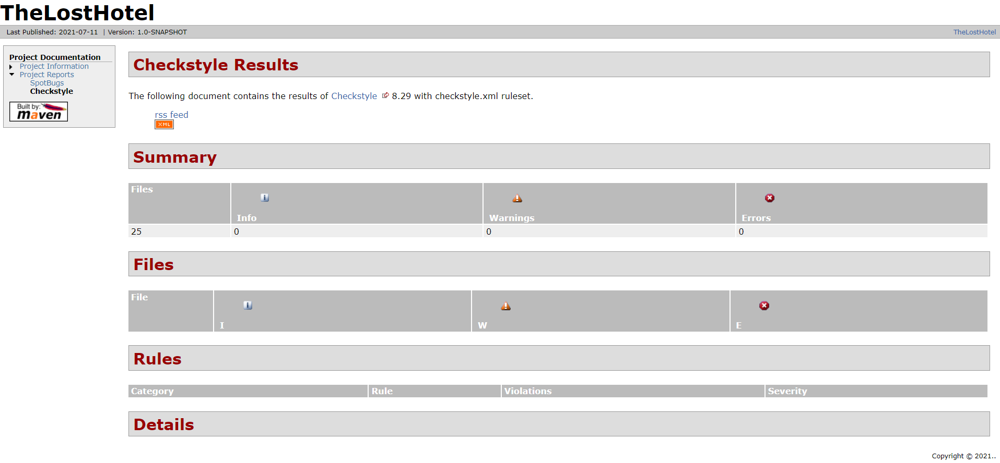
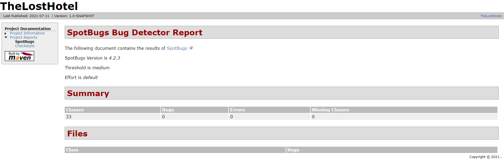

# THE LOST HOTEL

## Indice

1. [Introduzione](#Introduzione)
    - [Trama del gioco](#Trama-del-gioco)  
    - [Mappa di gioco](#Mappa-di-gioco)  
    
2. [Modello di dominio (da valutare)](#Modello-di-dominio)

3. [Requisiti specifici](#Requisiti-specifici)
    - [Requisiti funzionali](#Requisiti-funzionali)  
    - [Requisiti non funzionali](#Requisiti-non-funzionali)

4. [O.O. Design](#OO-Design)
    - [Diagrammi delle classi](#Diagrammi-delle-classi)

5. [Contenuti rilevanti](#Contenuti-rilevanti)
    - [Lettura/scrittura su File](#Lettura-scrittura-su-File)  
    - [Connessione a database](#Connessione-a-database)  
    - [GUI mediante SWING](#GUI-mediante-SWING)  
    - [Thread](#Thread)  
    - [Lambda expression](#Lambda-expression)  
    - [Javadoc](#Javadoc) 

6. [Riepilogo dei test](#Riepilogo-dei-test)
    - [Analisi statica del codice](#Analisi-statica-del-codice)
        - [Checkstyle](#Checkstyle)  
        - [Spotbugs](#Spotbugs)
    
7. [Processo di sviluppo e organizzazione del lavoro](#Processo-di-sviluppo-e-organizzazione-del-lavoro)
    - [Product backlog](#Product-backlog)  
    - [Strumenti di lavoro](#Strumenti-di-lavoro)

8. [Analisi retrospettiva](#Analisi-retrospettiva)
    - [Soddisfazioni](#Soddisfazioni)  
    - [Insoddisfazioni](#Insoddisfazioni)  
    - [Cosa ci ha fatti impazzire](#Cosa-ci-ha-fatto-impazzire)

 

# Introduzione

La seguente relazione è stata sviluppata per il progetto che implementa il gioco <code>The Lost Hotel</code> del gruppo MTM-Develop, i cui membri sono:
- [Gaetano Malerba](https://github.com/GaeMale)
- [Enrico Mangia](https://github.com/EnMa4) 
- [Giovanni Todisco](https://github.com/GioTod)   
  

L'interfaccia dell'applicazione consente all'utente sia di digitare testualmente i comandi di gioco, sia di poter interagire tramite i bottoni presenti nel programma.
   

Lo scopo di questo progetto è quello di creare un'avventura grafico/testuale che possa essere utilizzata da utenti che abbiano 
una minima conoscenza di questa tipologia di applicazione.  Inoltre, si tende a precisare che l'obiettivo di questo progetto è quello di dimostrare le competenze acquisite durante il corso di <i>Metodi Avanzati di Programmazione</i>.
  //aggiungere

## Trama del gioco
Il gioco si presenta con una descrizione della trama, che mostra all'utente una panoramica su ciò che è successo prima del punto di partenza:

    7 gennaio 2000, 21:32

                L'appuntamento importante è alle porte e decidi di riunirti 
                con gli amici di sempre (Ethan e John)
                per organizzare il tutto.
                Ancora qualche giorno e poi finalmente passerete 
                una settimana insieme in America.
                Lo aspettavate dalle scuole medie!

    12 gennaio 2000, 22:03
        
                Poichè il viaggio è lungo e stancante, decidete di partire
                in tarda serata per non perdere il volo.
                Si sa, l'uomo mira sempre al risparmio,
                e anche questa volta non vi siete lasciati sfuggire questo
                super volo low-cost presso un'agenzia britannica privata.
                Quindi, questo estenuante viaggio in macchina 
                sarà il prezzo da pagare...

    12 gennaio 2000, 23:56
        
                Sono passate circa due ore ma sembra 
                che il viaggio duri il doppio.
                Siete in una strada di periferia, quando all'improvviso
                Ethan impreca: "Spia rossa del motore.
                Cazzo, ci voleva solo questa!"
                "Speriamo che la macchina regga fino a destinazione",
                ribatte John.
                Passati esattamente 5 minuti, ecco che si intravede
                del fumo bianco dal motore.
                Presi dalla rabbia e disperazione,
                vi fermate e cerchi subito soccorso.
                Il telefono, come da previsione, non dà segni di vita.
                <<Beep - Beep - Beep>> "Non prende, ovviamente!",
                esclami.

    "13 gennaio 2000, 00:33

                È ormai mezzanotte inoltrata. È iniziato a piovere,
                il freddo e la stanchezza si fanno sentire.
                Sembra che il viaggio che aspettavate da una vita 
                stia diventando un incubo!
                Quando in lontananza Ethan vede una struttura 
                mezza illuminata ed esclama:
                "È un hotel, magari potremmo passare 
                la nottata qui e chiedere aiuto".
                Così, non avendo altre possibilità,
                vi rassegnate e decidete di entrare.
                Prima di abbandonare l'auto, riempi il tuo zaino 
                con un paio di oggetti che
                potrebbero esserti utili...

## Mappa del gioco  
//inserire immagine mappa di gioco

Il gioco inizia con il protagonista che si sveglia all'interno della <b><i>Stanza 79</b></i>. 
 Dirigendosi verso <b>Nord</b> si avrà modo di entrare nel primo <b><i>Corridoio</i></b> dell'hotel. Per accedere ad esso, l'utente dovrà essere in grado di trovare la chiave per sbloccare l'accesso ad esso.  
Nel <b><i>Corridoio</i></b> vi saranno altre stanze in cui sarà possibile scovare segreti e oggetti al fine di completare il gioco.

Ad <b>Ovest</b> vi è il <b><i>Corridoio Columbus</i></b>, il cui accesso è libero.  
Qui l'utente potrà accedere a varie stanze per prendere gli oggetti necessari per il proseguio dell'avventura.
Andando a <b>Sud</b> entrerà nella <b><i>Stanza 53</b></i> dove sarà possibile raccogliere il gancio per aprire la ventola della <b><i>Lavanderia</b></i>. 
Dalla <b><i>Stanza 53</b></i> attraverso il comando <code>apri finestra</code> sarà possibile avere accesso al <b><i>Giardino</i></b> e successivamente alla <b><i>Stanza 63</b></i> dove si potrà raccogliere il fucile che sarà indispensabile per la vittoria del gioco. 

Spostandosi verso <b>Nord</b> del <b><i>Corridoio Columbus</b></i> sarà possibile accedere al <b><i>Corridoio Clippings</i></b>, l'ultimo prima delle stanze finali. 
Qui sono presenti la <b><i>Cucina</i></b>, la <b><i>CCTV</i></b> e la <b><i>Lavanderia</i></b>.  
Dalla <b><i>Lavanderia</i></b> sarà possibile aver accesso alla <b><i>Hall</i></b> aprendo la ventola con il comando <code>apri ventola con gancio</code>. 
Successivamente, tramite il comando <code>usa ventola</code>, si potrà entrare nella <b><i>Hall</b></i> solamente nel caso in cui l'utente abbia nell'inventario 2 oggetti fondamentali (<u><i>Mappa della cassaforte della hall</u></i> e <u><i>Foto rappresentate una delle due combinazioni per aprire questa</i></u>) per il continuo del gioco.
 
Qui è presente una cassaforte.   
Se l'utente è stato in grado di raccogliere tutti gli elementi fondamentali per arrivare sin qui, sarà in grado di sbloccare la cassaforte usando il comando <code>inserisci [combinazione] in cassaforte</code>, la quale conterrà la chiave per sbloccare la <b><i>Stanza 13</b></i>, dove si concluderà l'avventura.

Una volta aperta la cassaforte potrà raccogliere la chiave e dirigersi ad <b>Ovest</b> per completare il gioco.  
Gli verrà assegnato un punteggio in base al tempo impiegato per completare il tutto e soprattuto potrebbe essere soggetto ad una penalità in caso non abbia raccolto l'elemento principale per la vittoria, il <b>fucile</b>.

[Torna all'indice](#Indice)   

# Riepilogo dei test
Questa sezione evidenzia i risultati e le modalità con cui è stato testato il software.  

## Analisi statica del codice
Si è deciso di utilizzare l’Analisi statica del codice poichè permette di analizzare il codice sorgente e di mettere in evidenza le problematiche riscontrate. 

Tra i principali strumenti per svolgere il testing del codice è stato scelto di utilizzare [Checkstyle](https://checkstyle.org) e [Spotbugs](https://spotbugs.github.io). 

- ## Checkstyle
    - <b>Checkstyle</b> è uno strumento di analisi del codice statico, utilizzato per scoprire eventuali violazioni dello stile di programmazione e verificare se il codice sorgente è conforme alle regole di codifica specificate. 
    Di seguito ne riportiamo brevemente il risultato:  
    >

- ## Spotbugs
    - Relativamente invece all'altro analizzatore statico del codice, <b>Spotbugs</b> si occupa di inviduare potenziali difetti che possono comportare malfunzionamenti nel codice. 
    Ne riportiamo brevemente l'output:  
    >

[Torna all'indice](#Indice)   