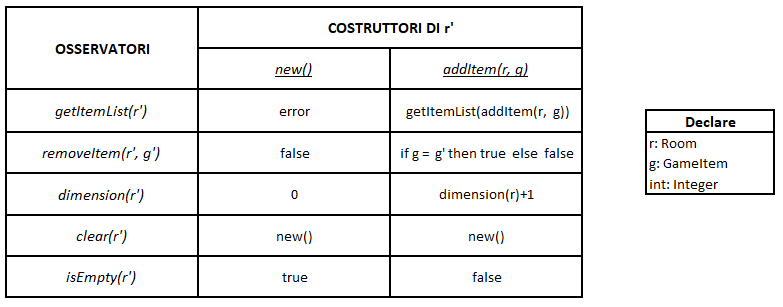
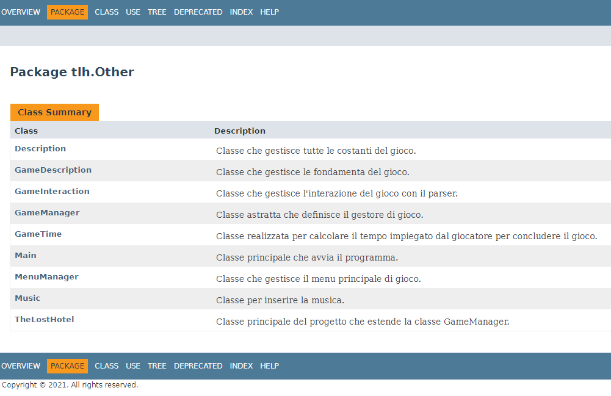

# THE LOST HOTEL

## Indice

1. [Introduzione](#Introduzione)
    - [Trama del gioco](#Trama-del-gioco)  
    - [Mappa di gioco](#Mappa-di-gioco)  
    - [Come completare l'avventura](#Come-completare-lavventura)

2. [Requisiti specifici](#Requisiti-specifici)
    - [Requisiti funzionali](#Requisiti-funzionali)  
    - [Requisiti non funzionali](#Requisiti-non-funzionali)

3. [O.O. Design](#OO-Design)
    - [Diagrammi delle classi](#Diagrammi-delle-classi)  
    - [Specifica algebrica della classe Room](#Specifica-algebrica-della-classe-Room)
        - [Specifica sintattica](#Specifica-sintattica)
        - [Specifica semantica](#Specifica-semantica)
        - [Osservazione binaria](#Osservazione-binaria)
        - [Specifica di restrizione](#Specifica-di-restrizione)

4. [Contenuti rilevanti](#Contenuti-rilevanti)
    - [Lettura/scrittura su File](#Lettura-scrittura-su-File)  
    - [Connessione a database](#Connessione-a-database)  
    - [GUI mediante SWING](#GUI-mediante-SWING)  
    - [Thread](#Thread)  
    - [Javadoc](#Javadoc)  
        - [Package Database](#Package-Database)  
        - [Package File](#Package-File)  
        - [Package GUI](#Package-GUI)  
        - [Package Other](#Package-Other)  
        - [Package Parser](#Package-Parser)  
        - [Package Type](#Package-Type)  

5. [Riepilogo dei test](#Riepilogo-dei-test)
    - [Analisi statica del codice](#Analisi-statica-del-codice)
        - [Checkstyle](#Checkstyle)  
        - [Spotbugs](#Spotbugs)
    
6. [Processo di sviluppo e organizzazione del lavoro](#Processo-di-sviluppo-e-organizzazione-del-lavoro)
    - [Piattaforma di comunicazione adottata](#Piattaforma-di-comunicazione-adottata)

7. [Analisi retrospettiva](#Analisi-retrospettiva)
    - [Soddisfazioni](#Soddisfazioni)  
    - [Cosa ci ha fatto impazzire](#Cosa-ci-ha-fatto-impazzire)

 

# Introduzione

La seguente relazione è stata sviluppata per il progetto che implementa il gioco <b>[The Lost Hotel](https://github.com/MTM-Develop/TheLostHotel)</b> del gruppo <b><i>MTM-Develop</b></i>, i cui membri sono:
- [Gaetano Malerba](https://github.com/GaeMale)
- [Enrico Mangia](https://github.com/EnMa4) 
- [Giovanni Todisco](https://github.com/GioTod)   
  

L'interfaccia dell'applicazione consente all'utente sia di digitare testualmente i comandi di gioco, sia di poter interagire tramite i bottoni presenti nel programma.
   

Lo scopo di questo progetto è quello di creare un'avventura grafico/testuale che possa essere utilizzata da utenti che abbiano 
una minima conoscenza di questa tipologia di applicazione.  Inoltre, si tende a precisare che l'obiettivo di questo progetto è quello di dimostrare le competenze acquisite durante il corso di <i>Metodi Avanzati di Programmazione</i>.

---

[Torna all'indice](#Indice)   

## Trama del gioco

L'avventura ha inizio nel gennaio del 2000: il protagonista, insieme ai suoi due amici inseparabili (<b>John</b> e <b>Ethan</b>), decidono di passare una settimana assieme in America. 
Vista la stanchezza del viaggio che li aspetta, i tre optano per partire in tarda serata per arrivare alle prime ore dell'alba in un aeroporto distante centinaia di chilometri, poichè hanno deciso di prenotare un volo economico. 
Dopo circa due ore dalla partenza, arrivati in una strada di periferia, iniziano le prime difficoltà: dal motore esce del fumo bianco, il telefono assente, e la pioggia inizia ad essere incessante. 
Ethan, notando in lontananza un hotel mezzo illuminato, suggerisce di passare la nottata lì per poi chiedere aiuto. 
Ma non sanno cosa li aspetta lì dentro...
 

---

[Torna all'indice](#Indice)   

## Mappa di gioco  

>

Il gioco inizia con il protagonista che si sveglia all'interno della <b><i>Stanza 79</b></i>. 
 Dirigendosi verso <b>Nord</b> si avrà modo di entrare nel primo <b><i>Corridoio</i></b> dell'hotel. Per accedere ad esso, l'utente dovrà essere in grado di trovare la chiave per sbloccare l'accesso a questo.  
Nel <b><i>Corridoio</i></b> vi saranno altre stanze in cui sarà possibile scovare segreti e oggetti al fine di completare il gioco.

Ad <b>Ovest</b> vi è il <b><i>Corridoio Columbus</i></b>, il cui accesso è libero.  
Qui l'utente potrà accedere a varie stanze per prendere gli oggetti necessari per il proseguio dell'avventura.
Andando a <b>Sud</b> entrerà nella <b><i>Stanza 53</b></i> dove sarà possibile raccogliere il gancio per aprire la ventola della <b><i>Lavanderia</b></i>. 
Dalla <b><i>Stanza 53</b></i> attraverso il comando <code>apri finestra</code> sarà possibile avere accesso al <b><i>Giardino</i></b> e successivamente alla <b><i>Stanza 63</b></i> dove si potrà raccogliere il fucile che sarà indispensabile per la vittoria del gioco. 

Spostandosi verso <b>Nord</b> del <b><i>Corridoio Columbus</b></i> sarà possibile accedere al <b><i>Corridoio Clippings</i></b>, l'ultimo prima delle stanze finali. 
Qui sono presenti la <b><i>Cucina</i></b>, la <b><i>CCTV</i></b> e la <b><i>Lavanderia</i></b>.  
Dalla <b><i>Lavanderia</i></b> sarà possibile aver accesso alla <b><i>Hall</i></b> aprendo la ventola con il comando <code>apri ventola con gancio</code>. 
Successivamente, tramite il comando <code>usa ventola</code>, si potrà entrare nella <b><i>Hall</b></i> solamente nel caso in cui l'utente abbia nell'inventario 2 oggetti fondamentali (<u><i>Mappa della cassaforte della hall</u></i> e <u><i>Foto rappresentate una delle due combinazioni per aprire questa</i></u>) per il continuo del gioco.
 
Qui è presente una cassaforte.   
Se l'utente è stato in grado di raccogliere tutti gli elementi fondamentali per arrivare sin qui, sarà in grado di sbloccare la cassaforte usando il comando <code>inserisci [combinazione] in cassaforte</code>, la quale conterrà la chiave per sbloccare la <b><i>Stanza 13</b></i>, dove si concluderà l'avventura.

Una volta aperta la cassaforte potrà raccogliere la chiave e dirigersi ad <b>Ovest</b> per completare il gioco.  
Gli verrà assegnato un punteggio in base al tempo impiegato per completare il tutto e, soprattuto, potrebbe essere soggetto ad una penalità nel caso in cui non abbia raccolto l'elemento principale per la vittoria, il <b>fucile</b>.

Il gioco al primo avvio si presenta così, mostrando l'immagine della stanza inziale e, a sinistra, la trama completa dell'avventura. 
>

Per la realizzazione delle immagini delle singole stanze è stato utilizzato il software online [Planner5d](https://planner5d.com/it/).

---

[Torna all'indice](#Indice)   

## Come completare l'avventura
Di seguito riportiamo i vari passaggi per completare con successo l'avventura:

<b>STANZA 79</b>: 
<code>apri mobile</code> 
<code>prendi fermacapelli</code> 
<code>apri armadio con fermacapelli</code> 
<code>prendi chiave17</code> 
<code>sposta quadro</code> 
<code>prendi chiave79</code> 
<code>usa chiave79</code> 

<b>CORRIDOIO</b>: 
<code>usa chiave17</code> 

<b>SALA GIOCHI</b>: 
<code>usa slot</code> 
<code>prendi maniglia</code> 

<b>STANZA 53</b>: 
<code>apri como</code> 
<code>prendi chiave47</code> 
<code>sposta attaccapanni</code> 
<code>prendi gancio</code> 
<code>prendi usb</code> 
<code>apri finestra</code> 

<b>GIARDINO</b>: 
<code>sposta sdraio</code> 
<code>prendi chiave63</code> 

<b>STANZA 63</b>: 
<code>prendi fucile</code> 
<code>usa chiave63</code> 

<b>CORRIDOIO COLUMBUS</b>: 
<code>usa chiave47</code> 

<b>BAR COLUMBUS</b>: 
<code>apri cassa con chiave47</code> 
<code>prendi tessera3</code> 
<code>sposta tazza</code> 
<code>prendi gettone</code> 

<b>SALA GIOCHI</b>: 
<code>inserisci gettone in cambiamonete</code> 
<code>prendi tessera2</code> 

<b>CORRIDOIO COLUMBUS</b>: 
<code>usa tessera2</code> 

<b>CORRIDOIO CLIPPINGS</b>: 
<code>usa tessera3</code> 

<b>CCTV</b>: 
<code>apri vetrina</code> 
<code>prendi foglio47</code> 
<code>inserisci usb in fisso</code> 
<code>usa cellulare</code> 
<code>inserisci 522727 in cassaforte</code> 
<code>apri cassaforte</code> 
<code>prendi chiave77</code> 

<b>CORRIDOIO CLIPPINGS</b>: 
<code>usa chiave77</code> 

<b>LAVANDERIA</b>: 
<code>apri ventola con gancio</code> 
<code>usa ventola</code> 

<b>HALL</b>: 
<code>inserisci 573874 in cassaforte</code> 
<code>apri cassaforte</code> 
<code>prendi chiave13</code> 
<code>usa chiave13</code> 

<b>STANZA 13</b>: 
<code>usa fucile</code> 

---
[Torna all'indice](#Indice)   

# Requisiti specifici
Di seguito sono riportati tutti i requisiti per l'applicazione <b>The Lost Hotel</b>, suddivisi in requisiti funzionali e non funzionali.

---

## Requisiti funzionali
I FUR <i>(Functional User Requirement)</i> descrivono le funzionalità del software in termini di:
- elenchi di funzionalità o servizi che il sistema deve fornire;
- risposte che l’utente si aspetta dal software in determinate situazioni;
- risultati che il software deve produrre di fronte a specifici input. 

Riportiamo i requisiti funzionali dell'applicazione:

| Requisito | Descrizione |
|--|--|
| Avviare una nuova partita | Nel menu principale, cliccando su <code>Avvia una nuova partita</code> (oppure, premendo <code>CTRL-N</code>) l'applicazione permette all'utente di inserire il suo nome di avventura e iniziare una nuova partita. |
| Caricare una partita esistente | Nel menu principale, cliccando su <code>Carica una partita esistente</code> (oppure, premendo <code>CTRL-C</code>) l'applicazione carica la partita salvata e permette all'utente di continuare la sua avventura dal punto in cui si era fermato. |
| Uscire dall'applicazione | Nel menu principale, cliccando su <code>Esci</code> l'applicazione permette all'utente di chiudere correttamente il programma. |
| Mostrare l'elenco dei comandi | Al comando <code>help</code> o <code>aiuto</code> o <code>guida</code> (oppure, premendo <code>CTRL-L</code>) l'applicazione mostra la lista dei comandi riconosciuti, uno per riga. |
| Muovere a Nord | Al comando <code>nord</code> (oppure, premendo <code>ALT-N</code>) l'applicazione permette al giocatore di muoversi verso Nord.  Se la stanza è chiusa a chiave viene mostrato il messaggio <code>Questa stanza è chiusa!</code>.  Se, invece, non è presente nessun collegamento tra la stanza corrente e la stanza a Nord, viene mostrato il messaggio <code>Non puoi andare lì!</code> e l'applicazione rimane in attesa di un comando valido. |
| Muovere a Sud | Al comando <code>sud</code> (oppure, premendo <code>ALT-S</code>) l'applicazione permette al giocatore di muoversi verso Sud.  Se la stanza è chiusa a chiave viene mostrato il messaggio <code>Questa stanza è chiusa!</code>.  Se, invece, non è presente nessun collegamento tra la stanza corrente e la stanza a Sud, viene mostrato il messaggio <code>Non puoi andare lì!</code> e l'applicazione rimane in attesa di un comando valido. |
| Muovere ad Est | Al comando <code>est</code> (oppure, premendo <code>ALT-E</code>) l'applicazione permette al giocatore di muoversi verso Est.  Se la stanza è chiusa a chiave viene mostrato il messaggio <code>Questa stanza è chiusa!</code>.  Se, invece, non è presente nessun collegamento tra la stanza corrente e la stanza ad Est, viene mostrato il messaggio <code>Non puoi andare lì!</code> e l'applicazione rimane in attesa di un comando valido. |
| Muovere ad Ovest | Al comando <code>ovest</code> (oppure, premendo <code>ALT-O</code>) l'applicazione permette al giocatore di muoversi verso Ovest.  Se la stanza è chiusa a chiave viene mostrato il messaggio <code>Questa stanza è chiusa!</code>.  Se, invece, non è presente nessun collegamento tra la stanza corrente e la stanza ad Ovest, viene mostrato il messaggio <code>Non puoi andare lì!</code> e l'applicazione rimane in attesa di un comando valido. |
| Mostrare l'inventario | Al comando <code>inventario</code> o <code>inv</code> o <code>zaino</code> o <code>sacca</code> l'applicazione mostra testualmente la lista degli oggetti raccolti dal giocatore. Oppure, premendo l'icona dello zaino situata in alto a destra, visualizza questa in forma grafica. |
| Osservare la stanza corrente | Al comando <code>guarda</code> o <code>osserva</code> o <code>vedi</code> o <code>descrivi</code> o <code>controlla</code> o <code>esamina</code> l'applicazione mostra all'utente una descrizione più dettagliata della stanza dove si trova momentaneamente. |
| Osservare un oggetto | Al comando <code>guarda [oggetto]</code> o <code>osserva [oggetto]</code> o <code>vedi [oggetto]</code> o <code>descrivi [oggetto]</code> o <code>controlla [oggetto]</code> o <code>esamina [oggetto]</code> l'applicazione mostra all'utente la descrizione dell'oggetto richiesto, se presente nell'inventario o nella stanza corrente (non per forza visibile nell'immagine di questa). |
| Usare un oggetto | Al comando <code>usa [oggetto]</code> o <code>utilizza [oggetto]</code> il giocatore può utilizzare l'oggetto specificato, se presente nell'inventario o nella stanza corrente. |
| Aprire un oggetto | Al comando <code>apri [oggetto contenitore]</code> l'applicazione permette al giocatore di aprire l'oggetto contenitore specificato, se presente nella stanza corrente. N.B: Tale comando sarà accettato nel caso in cui il contenitore non sia bloccato da un oggetto, altrimenti sarà visualizzato il messaggio <code>Non puoi aprire quest'oggetto così!</code>.  Per aprire contenitori bloccati sarà necessario inserire il comando <code>apri [oggetto contenitore] con [oggetto]</code>, dove <code>[oggetto]</code> sarà naturalmente ciò che blocca il contenitore. |
| Spostare un oggetto | Al comando <code>sposta [oggetto]</code> o <code>muovi [oggetto]</code> o <code>trascina [oggetto]</code> il giocatore può spostare l'oggetto specificato, a patto che sia della stanza corrente. |
| Prendere un oggetto | Al comando <code>prendi [oggetto]</code> o <code>raccogli [oggetto]</code> o <code>afferra [oggetto]</code> o <code>agguanta [oggetto]</code> o <code>piglia [oggetto]</code> l'applicazione permette all'utente di raccogliere l'oggetto specificato, se presente nella stanza corrente (a terra o in un contenitore sbloccato). N.B: Per prendere un oggetto, il giocatore non deve aver riempito completamente l'inventario (massimo 10 oggetti), altrimenti il comando non sarà valido e dovrà lasciare un oggetto tra quelli in suo possesso. |
| Lasciare un oggetto | Al comando <code>lascia [oggetto]</code> o <code>molla [oggetto]</code> o <code>abbandona [oggetto]</code> il giocatore può lasciare l'oggetto specificato nella stanza corrente, a patto che sia presente nell'inventario. |
| Inserire un oggetto | Al comando <code>inserisci [oggetto] in [oggetto contenitore]</code> o <code>immetti [oggetto] in [oggetto contenitore]</code> o <code>infila [oggetto] in [oggetto contenitore]</code> o <code>introduci [oggetto] in [oggetto contenitore]</code> o <code>metti [oggetto] in [oggetto contenitore]</code> l'applicazione permette all'utente di inserire l'oggetto nel contenitore specificato, se l'<code>[oggetto]</code> è presente nell'inventario e l'<code>[oggetto contenitore]</code> è della stanza corrente. Se l'<code>[oggetto contenitore]</code> è una <b>cassaforte</b>, per <code>[oggetto]</code> si intende la <b>combinazione</b> per sbloccare questa.|
| Salvare la partita corrente | Cliccando su <code>Salva</code> (oppure, premendo <code>CTRL-S</code>) l'applicazione salva la partita corrente e rimane in attesa di un comando valido. |
| Tornare al menu principale| Cliccando su <code>Esci</code> (oppure, premendo <code>CTRL-Q</code>) all'utente è permesso di tornare al menu principale. In caso di progressi non salvati, l'applicazione dà la possibilità di salvarli. |
| Abilitare testo rapido| Cliccando su <code>Fast Text</code>, presente nella sezione <code>Text</code> (oppure, premendo <code>CTRL-F</code>) sarà possibile abilitare o meno il testo rapido. Di default questa funzione è disabilitata.|
| Abilitare musica| Cliccando su <code>Abilita Musica</code>, presente nella sezione <code>Musica</code> (oppure, premendo <code>CTRL-M</code>) sarà possibile abilitare o meno la musica di gioco. Di default questa funzione è abilitata anche se è soggetta, al primo avvio, a possibili errori di riproduzione. |

---

[Torna all'indice](#Indice)   

## Requisiti non funzionali
I NFR <i>(Non Functional Requirement)</i> rappresentano i vincoli e le caratteristiche relative ad un sistema, le tecnologie e gli standard che il software deve adottare.  

Riportiamo i requisiti non funzionali dell'applicazione:

| Requisito | Descrizione |
|--|--|
| Usabilità /  Affidabilità | Il software prevede che l'utente conosca le regole generali di un'avventura testuale. L'applicazione è progettata in modo tale che ogni possibile forma di errore venga riconosciuta dal programma e notificata all'utente in forma testuale.   Inoltre, è sviluppata in modo che non vengano sollevate eccezioni. |
| Modularità  /  Riusabilità /  Manutenibilità |Il software è ideato utilizzando i fondamenti del linguaggio OO Java ed è suddiviso secondo l'architettura MVC (<i>Model View Controller</i>) in modo da separare la logica di business da quella di visualizzazione.   L'applicazione è progettata in modo da poter essere utilizzata per l'implementazione di altri giochi simili aggiungendo nuovi comandi e azioni, in quanto prevede la classe astratta <b>GameManager</b>.  La classe <b>TLHStart</b> è provvista di un proprio main per poter essere eseguita e caricare sul file <i>NewGame.dat</i> i vari oggetti e stanze relativi all'avventura.  Infine, è stata creata una classe <b>Description</b> contenente tutte le costanti riconosciute dal programma, in modo da poter semplificare la lettura e l'eventuale scrittura di nuove.|
| Portabilità | L'applicazione è eseguibile sui seguenti sistemi operativi aventi la JDK 11: <li> Windows NT; <li>macOS; <li>Linux; <li>Oracle Solaris.|

---

[Torna all'indice](#Indice)   

# O.O. Design

## Diagramma delle classi

Di seguito riportiamo il diagramma delle classi più significative:

>

Descriviamo le varie relazioni tra le classi:

- La classe <b><i>GameItemContainer</b></i> presenta:
    - una <b>relazione di generalizzazione</b> con la classe <b><i>GameItem</b></i>, in quanto la prima estende la seconda;
    - una <b>relazione di associazione</b> con la classe <b><i>Inventory</b></i>, in quanto la prima presenta un'istanza della seconda;
    - una <b>relazione di aggregazione</b> con la classe <b><i>TLHStart</b></i>, avente molteplicità "zero o più" in quanto la seconda può istanziare più di un oggetto della prima.   

- La classe <b><i>GameItem</b></i> presenta:
    - una <b>relazione di aggregazione</b> con la classe <b><i>TLHStart</b></i>, avente molteplicità "zero o più" in quanto la seconda può istanziare più di un oggetto della prima.   

- La classe <b><i>Inventory</b></i> presenta:
    - una <b>relazione di associazione</b> con la classe <b><i>GameItem</b></i>, in quanto la prima presenta un'istanza della seconda.   

- La classe <b><i>Room</b></i> presenta:
    - una <b>relazione di dipendenza</b> con la classe <b><i>GameItem</b></i>, in quanto la prima utilizza o dipende da un elemento della seconda;
    - una <b>relazione di associazione</b> con la classe <b><i>Inventory</b></i>, in quanto la prima presenta un'istanza della seconda;
    - una <b>relazione riflessiva</b>, in quanto oggetti di questa classe possono avere collegamenti con oggetti della stessa classe.   

- La classe <b><i>Description</b></i> presenta:
    - una <b>relazione di aggregazione</b> con la classe <b><i>TLHStart</b></i>, avente molteplicità "zero o più" in quanto la seconda può istanziare più di un oggetto della prima.   

- La classe <b><i>Command</b></i> presenta:
    - una <b>relazione di aggregazione</b> con la classe <b><i>TLHStart</b></i>, avente molteplicità "zero o più" in quanto la seconda può istanziare più di un oggetto della prima.      

- La classe <b><i>TLHStart</b></i> presenta:
    - una <b>relazione di associazione</b> con la classe <b><i>GameDescription</b></i>, in quanto la prima presenta un'istanza della seconda.        

- La classe <b><i>Main</b></i> presenta:
    - una <b>relazione di dipendenza</b> con la classe astratta <b><i>GameManager</b></i>, in quanto la prima utilizza o dipende da un elemento della seconda.        

- La classe astratta <b><i>GameManager</b></i> presenta:
    - una <b>relazione di associazione</b> con la classe <b><i>GameDescription</b></i>, in quanto la prima presenta un'istanza della seconda.      

- La classe <b><i>TheLostHotel</b></i> presenta:
    - una <b>relazione di generalizzazione</b> con la classe astratta <b><i>GameManager</b></i>, in quanto la prima estende la seconda;
    - una <b>relazione di dipendenza</b> con la classe <b><i>GameDescription</b></i>, in quanto la prima utilizza o dipende da un elemento della seconda;
    - una <b>relazione di dipendenza</b> con la classe <b><i>ParserOutput</b></i>, in quanto la prima utilizza o dipende da un elemento della seconda.   

- La classe <b><i>GameInteraction</b></i> presenta:
    - una <b>relazione di associazione</b> con la classe astratta <b><i>GameManager</b></i>, in quanto la prima presenta un'istanza della seconda;
    - una <b>relazione di associazione</b> con la classe <b><i>Parser</b></i>, in quanto la prima presenta un'istanza della seconda.   

- La classe <b><i>Parser</b></i> presenta:
    - una <b>relazione di dipendenza</b> con la classe <b><i>ParserOutput</b></i>, in quanto la prima utilizza o dipende da un elemento della seconda.    

- La classe <b><i>ParserOutput</b></i> presenta:
    - una <b>relazione di dipendenza</b> con la classe enumerativa <b><i>WordType</b></i>, in quanto la prima utilizza o dipende da un elemento della seconda.  

---

[Torna all'indice](#Indice)   

## Specifica algebrica della classe Room
Riportiamo di seguito la specifica algebrica della classe Room:

---

## Specifica sintattica
- TIPI: 
    - <b>Room</b>
    - <b>GameItem</b>
    - <b>Inventory</b>
    - <b>Integer</b>
    - <b>Boolean</b>   

- OPERATORI:
    - new() -> <b>Room</b>
    - getItemList(<b>Room</b>) -> <b>Inventory</b>
    - addItem(<b>Room</b>, <b>GameItem</b>) -> <b>Room</b>
    - removeItem(<b>Room</b>, <b>GameItem</b>) -> <b>Boolean</b>
    - dimension(<b>Room</b>) -> <b>Integer</b>
    - clear(<b>Room</b>) -> <b>Room</b>
    - isEmpty(<b>Room</b>) -> <b>Boolean</b>
    - equals(<b>Room</b>, <b>Room</b>) -> <b>Boolean</b>   

---

## Specifica semantica
Di seguito riportiamo la specifica semantica:
>

---

## Osservazione binaria
Riportiamo adesso l'osservazione binaria del metodo equals(a, b):
>

---

## Specifica di restrizione
<b>RESTRICTION:</b> 
getItemList(new()) = <b><i>error</i></b>;

Alcuni metodi <i>getter</i> e <i>setter</i> sono stati omessi.

---

[Torna all'indice](#Indice)   

# Contenuti rilevanti

## Lettura/scrittura su File

Per quanto riguarda l'utilizzo di <b>file</b> è stato creato il file <b><i>NewGame.dat </b></i>per la memorizzazione di tutti gli oggetti e le stanze dell'avventura.
Tale file viene creato eseguendo il main della classe <b>TLHStart</b>. 
Un altro utilizzo del file è relativo al salvataggio e caricamento della partita:  
 - Nel primo caso vengono salvati (nel file <b><i>TheLostHotel.dat</b></i>) l'inventario del giocatore, la stanza dove si trova attualmente e tiene traccia di tutti gli stati degli oggetti con cui ha interagito (Ex: oggetto spostato, usato, aperto, ...);
 - Nel secondo, invece, l'applicazione recupera i dati risalenti all'ultimo salvataggio effettuato dallo stesso file.

---

[Torna all'indice](#Indice)   

## Connessione a database
Questa sezione descrive l'uso dello standard <b>JDBC</b> (<i>Java Data Base Connectivity</i>).

Abbiamo scelto lo standard JDBC poiche è stato progettato in modo da semplificare tutte le normali operazioni di
interfacciamento con un database: connessione, creazione di tabelle, interrogazione e visualizzazione dei risultati.  
Per far ciò è stato necessario il <b>Database Engine H2</b> sfruttando la possibilità di non dover installare un apposito server.
Per utilizzarlo abbiamo aggiunto la corrispondente dipendenza nel <b><i>pom.xml</b></i>.

Il <code>create</code> della tabella <i><b>scores</b></i> del database <i><b>scores.mv</b></i> è composto da tre colonne:

| Name | Time | Vote |
|--|--|--|
|Di tipo <code>VARCHAR(25)</code>| Di tipo <code>TIME</code>| Di tipo <code>VARCHAR(2)</code>|

Il <b>database</b> viene utilizzato per tener traccia del tempo di completamento di gioco e, in base a questo, di dare un voto (compreso tra A+ ed F) al giocatore quando ha completato l'avventura.  
Il giocatore stesso può essere soggetto ad una penalità nel caso in cui termini il gioco senza aver equipaggiato l'oggetto <b>fucile</b>.  
Non appena il protagonista conclude l'avventura, vengono stampati testualmente i primi 3 giocatori che hanno ottenuto il voto migliore in ordine decrescente.

---

[Torna all'indice](#Indice)   

## GUI mediante SWING
Questa sezione descrive l'uso del framework di JAVA che permette la realizzazione di interfacce grafiche.

Il frame della classe <b>MenuGUI</b> presenta:
 - 3 <code>JButton</code> che permettono di avviare una nuova partita, caricare una partita esistente e uscire dall'applicazione;
 - 1 <code>JLabel</code> rappresentante l'immagine di sfondo;
 - 1 <code>JMenuBar</code> contenenti vari <code>JMenuItem</code> (Nuova partita e Carica partita).

Avviando una nuova partita dalla classe MenuGUI, verrà chiesto sottoforma di <code>InputDialog</code> del <code>JOptionPane</code> il nome con cui il giocatore vuole inziare l'avventura.

Il frame della classe <b>GameGUI</b> presenta:
 - 8 <code>JButton</code>:
    - 4 che permettono al giocatore di spostarsi (Nord, Sud, Est, Ovest);
    - 2 per salvare o caricare una partita;
    - 1 per effettuare l'invio del comando;
    - 1 per visualizzare graficamente gli oggetti presenti nell'inventario.
 - 4 <code>JLabel</code>:
    - 2 che riportano "Stanza Corrente: " e "Inserisci un comando: " ;
    - 1 rappresentante l'immagine di sfondo;
    - 1 per indicare la stanza corrente.
 - 2 <code>JScrollPane</code>:
    - 1 relativa alla <code>JTextPane</code>;
    - 1 relativa alla <code>JTextField</code>.
 - 1 <code>JTextPane</code> non editabile in cui vengono visualizzati i messaggi relativi al proseguio del gioco.
 - 1 <code>JTextField</code> in cui l'utente può inserire i comandi.
 - 1 <code>JMenuBar</code> contenente 4 scelte:
    - <b>Opzioni</b>: Per salvare la partita corrente o tornare al menu principale;
    - <b>Text</b>: Per abilitare o meno il <b>FastText</b>;
    - <b>Comandi</b>: Per visualizzare tramite <code>MessageDialog</code> la lista dei comandi;
    - <b>Musica</b>: Per abilitare o meno la musica di gioco.

Con le frecce direzionali l'utente potrà comunicare i comandi: <b>Nord</b>, <b>Sud</b>, <b>Est</b>, <b>Ovest</b>.  Nella <code>JTextField</code> l'utente inserirà i comandi.
Per facilitare il flow nell'utilizzo dell'applicazione, ogni comando potrà essere inviato premendo direttamente il tasto <b>"invio"</b> che genererà un evento <i>actionPerformed</i> che a sua volta gestirà l'invio del comando.  
Ad ogni input dell'utente, il <code>JTextPane</code> "scrollerà" in automatico in base alla lunghezza del testo da visualizzare, e verranno disabilitati tutte le componenti grafiche sopra citate (nel caso in cui l'utente non abbia abilitato l'opzione <b>FastText</b>). 
Questa scelta progettuale punta ad influenzare in positivo la <b><i>User experience</b></i>.

Cliccando l'icona in alto a destra, relativa all'inventario, verrà visualizzata il frame della classe <b>InventoryGUI</b> che presenta:
 - 1 <code>JPanel</code> contenente tutti gli oggetti presenti nell'inventario;
 - 1 <code>JScrollPane</code> al fine di scorrere tutti i GameItem dello zaino;
 - 1 <code>JLabel</code> contenente l'immagine di ciascuno oggetto.

---

[Torna all'indice](#Indice)   

## Thread
Nella classe <b>Music</b> è stata gestita la riproduzione della musica mediante il metodo <i><b>playSound</i></b> che fa partire un <b>Thread</b> il quale riproduce la musica, caricandola da un URL passato come parametro.  
Va sottolineato che tale metodo è di tipo <i><b>synchronized</b></i> poichè garantisce che tutto quello che viene fatto qui viene portato a compimento prima che un altro thread chiami lo stesso metodo.

---

[Torna all'indice](#Indice)   

## Javadoc
Riportiamo di seguito la panoramica dei package coperti da <b>Javadoc</b> e, successivamente, le rispettive classi:
>

 

## Package Database
>

 

## Package File
>

 

## Package GUI
>

 

## Package Other
>

 

## Package Parser
>

 

## Package Type
>

---

[Torna all'indice](#Indice)   

# Riepilogo dei test
Questa sezione evidenzia i risultati e le modalità con cui è stato testato il software.  

---

## Analisi statica del codice
Si è deciso di utilizzare l’Analisi statica del codice poichè permette di analizzare il codice sorgente e di mettere in evidenza le problematiche riscontrate. 

Tra i principali strumenti per svolgere il testing del codice è stato scelto di utilizzare [Checkstyle](https://checkstyle.org) e [Spotbugs](https://spotbugs.github.io). 

---

## Checkstyle
<b>Checkstyle</b> è uno strumento di analisi del codice statico, utilizzato per scoprire eventuali violazioni dello stile di programmazione e verificare se il codice sorgente è conforme alle regole di codifica specificate. 
Di seguito ne riportiamo brevemente il risultato:  
>

---

[Torna all'indice](#Indice)   

## Spotbugs
Relativamente invece all'altro analizzatore statico del codice, <b>Spotbugs</b> si occupa di inviduare potenziali difetti che possono comportare malfunzionamenti nel codice. 
Ne riportiamo brevemente l'output:  
>

---

[Torna all'indice](#Indice)   

# Processo di sviluppo e organizzazione del lavoro

Questa sezione descrive gli strumenti adoperati dal gruppo per lo sviluppo dell'applicazione.

---

## Piattaforma di comunicazione adottata
Il nostro gruppo ha utilizzato, per riunioni e condivisione dello schermo, la piattaforma
<b>[Microsoft Teams](https://www.microsoft.com/it-it/microsoft-teams/group-chat-software) </b>, in quanto consente di effettuare conferenze, presentazioni di qualità audio/video elevata e l'upload (caricamento) di file di diverse estensioni.  
>
 

Per l'intera durata del progetto abbiamo puntato ad un'alta forma di 
coordinazione, cercando di distribuire nel migliore dei modi le diverse attività, essendo pronti ad intervenire mediante riunione in caso di dubbi, difficoltà, chiarimenti.
 
Naturalmente, per comunicazione tempestive, avvisi generali e altre cose simili, si sono utilizzate le più comuni app di messaggistica, quali per esempio <i>WhatsApp</i>, mediante la creazione di un apposito gruppo, che ci consentisse di rimanere aggiornati.  
Tutti i membri del gruppo hanno utilizzato l'ambiente di sviluppo [IntelliJ IDEA](https://www.jetbrains.com/idea/).

---

[Torna all'indice](#Indice)   

# Analisi retrospettiva
## Soddisfazioni
Come gruppo, siamo stati molto soddisfatti e soprattutto stimolati dalla modalità di gestione del lavoro. Il modo in cui il lavoro è stato suddiviso e successivamente svolto, ci ha resi molto grati e soddisfatti per quello che stavamo creando, dato che si avvicina molto al mondo del lavoro.  Anche il progetto in sè andava oltre un banale esame di programmazione, ma mirava alla collaborazione tra ogni membro del gruppo e all'instaurazione di un rapporto di "complicità lavorativa" l'uno con l'altro.    
Un'altra cosa, per la quale siamo fieri, è sicuramente l'aver gestito e risolto tutti gli errori segnalati da [Checkstyle](#Checkstyle) e [Spotbugs](#Spotbugs).

---

[Torna all'indice](#Indice)   

## Cosa ci ha fatto impazzire

Abbiamo riscontrato parecchie difficoltà man mano che aumentavano il numero di oggetti da inserire nell'avventura.
È capitato che, inconsciamente, due oggetti distinti avessero lo stesso ID.
Questo ha portato errori a cui non riuscivamo a dare una spiegazione e ci ha portato a perdere abbastanza tempo.

Un'altra cosa per il quale abbiamo riscontrato diversi rallentamenti è stato sicuramente inserire per <b>ogni</b> costante, e non solo, il relativo commento Javadoc. 
Inoltre, Spotbugs ci ha segnalato un errore riguardo il codice di serializzazione della classe, poichè alcuni oggetti di essa non dovevano essere serializzati (infatti a questi è stata aggiunta la parola chiave <b>transient</b>). Di seguito riportiamo la riga di codice introdotta per risolvere tale problema: 
<i><b>static final long serialVersionUID = 42L</i></b>.

---
 
[Torna all'indice](#Indice)
